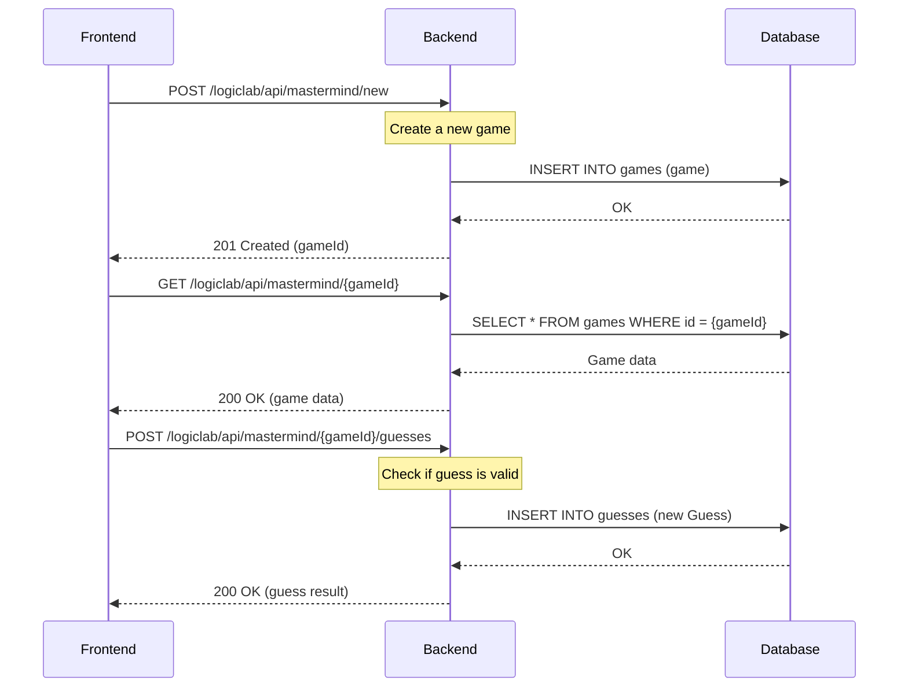
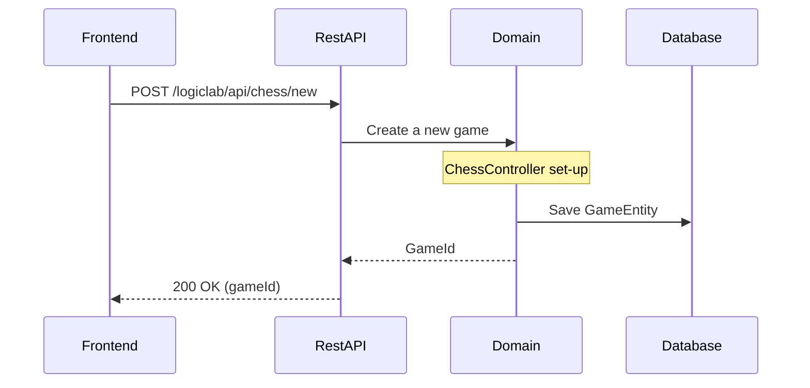
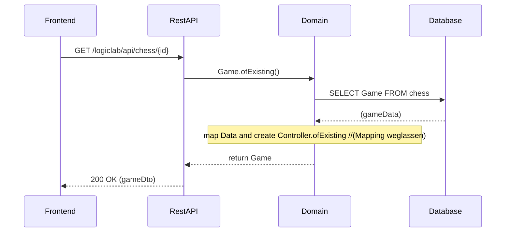
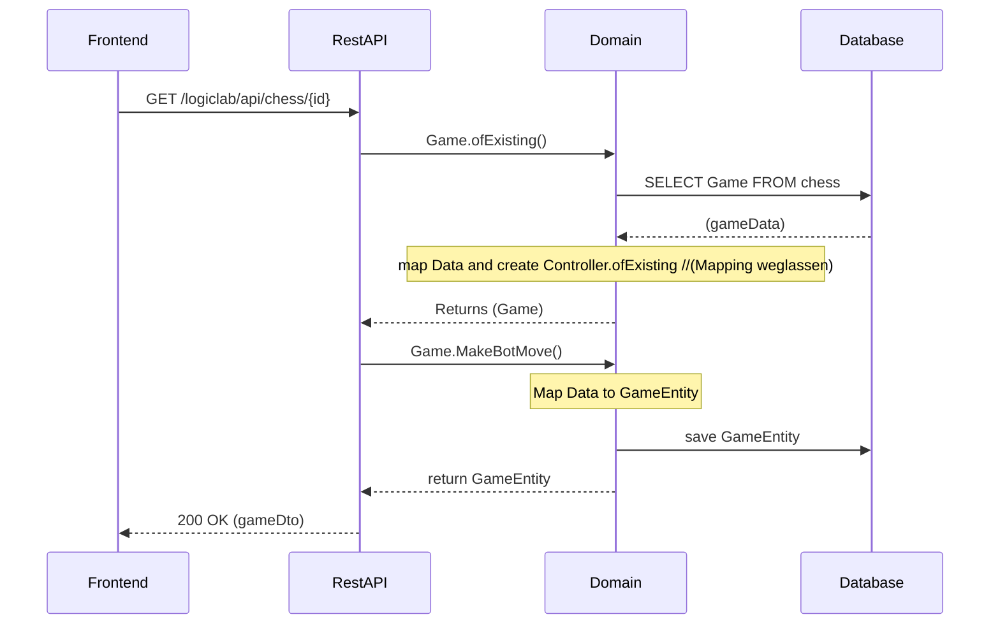

```mermaid
sequenceDiagram
    participant FE as Frontend
    participant BE as Backend
    participant DB as Database

    FE->>BE: POST /logiclab/api/mastermind/new
    note over BE: Create a new game
    BE->>DB: INSERT INTO games (game)
    DB-->>BE: OK
    BE-->>FE: 201 Created (gameId)

    FE->>BE: GET /logiclab/api/mastermind/{gameId}
    BE->>DB: SELECT * FROM games WHERE id = {gameId}
    DB-->>BE: Game data
    BE-->>FE: 200 OK (game data)

    FE->>BE: POST /logiclab/api/mastermind/{gameId}/guesses
    note over BE: Check if guess is valid
    BE->>DB: INSERT INTO guesses (new Guess)
    DB-->>BE: OK
    BE-->>FE: 200 OK (guess result)
```

```mermaid
sequenceDiagram
    participant FE as Frontend
    participant RE as RestAPI
    participant BE as Domain
    participant DB as Database

    FE->>RE: POST /logiclab/api/chess/new
    RE->>BE: Create a new game
    note over BE: ChessController set-up
    BE->>DB: Save GameEntity
    BE-->>RE: GameId
    RE-->>FE: 200 OK (gameId)
```

```mermaid
sequenceDiagram
    participant FE as Frontend
    participant RE as RestAPI
    participant BE as Domain
    participant DB as Database
    
    FE->>RE: GET /logiclab/api/chess/{id}
    RE->>BE: Game.ofExisting()
    BE->>DB: SELECT Game FROM chess
    DB-->>BE: (gameData)
    note over BE: map Data and create Controller.ofExisting //(Mapping weglassen)
    BE-->>RE: return Game
    RE-->>FE: 200 OK (gameDto)
```

```mermaid
sequenceDiagram
    participant FE as Frontend
    participant RE as RestAPI
    participant BE as Domain
    participant DB as Database
    
    FE->>RE: GET /logiclab/api/chess/{id}
    RE->>BE: Game.ofExisting()
    BE->>DB: SELECT Game FROM chess
    DB-->>BE: (gameData)
    note over BE: map Data and create Controller.ofExisting //(Mapping weglassen)
    BE-->>RE: Returns (Game)
    RE->>BE: Game.MakeMove()
    note over BE: Map Data to GameEntity
    BE->>DB: save GameEntity
    BE-->>RE: return GameEntity
    RE-->>FE: 200 OK (gameDto)
```

```mermaid
sequenceDiagram
    participant FE as Frontend
    participant RE as RestAPI
    participant BE as Domain
    participant DB as Database
    
    FE->>RE: GET /logiclab/api/chess/{id}
    RE->>BE: Game.ofExisting()
    BE->>DB: SELECT Game FROM chess
    DB-->>BE: (gameData)
    note over BE: map Data and create Controller.ofExisting //(Mapping weglassen)
    BE-->>RE: Returns (Game)
    RE->>BE: Game.MakeBotMove()
    note over BE: Map Data to GameEntity
    BE->>DB: save GameEntity
    BE-->>RE: return GameEntity
    RE-->>FE: 200 OK (gameDto)
```

